# Aquarium Study Guide

This sheet is the shortest version of how the aquarium works.

## Core Pixi Ideas

### `Application`

- Creates the Pixi program and canvas.
- In this project, it is set up in [index.html](index.html#L37-L45).

### `Container`

- A container is a group that can hold other visual objects.
- Moving a container moves all of its children.
- In this project:
  - `aquarium` holds the whole scene.
  - `school` holds the fish that swim together.

### `Sprite`

- A sprite displays an image texture.
- Here, every fish uses the same image file: [img/fish.png](img/fish.png).
- Different fish look unique because the code changes scale, tint, and movement.

### `Graphics`

- `Graphics` draws shapes directly in code.
- This project uses it for the tank, water, gravel, plants, rock, arch, glass highlights, and bubbles.

### `ticker`

- The ticker is the animation loop.
- It runs every frame and updates object properties like `x`, `y`, `rotation`, `scale`, and `tint`.
- In this project, the main ticker starts at [index.html](index.html#L213).

## How The Scene Is Organized

1. The page creates and styles the Pixi canvas.
2. The script loads the fish image.
3. The script draws the aquarium environment with `Graphics`.
4. The script creates fish objects with motion settings.
5. The ticker updates everything every frame.

## Motion Patterns To Remember

- `Math.sin(...)` is used for smooth looping motion.
- Fish bob up and down with sine waves.
- One fish flips direction by changing the sign of its x-scale.
- The school moves as a parent container while each child fish wiggles locally.
- Bubbles rise by decreasing `y` and reset when they reach the top.

## Scene Graph Diagram

```mermaid
graph TD
    Stage[app.stage]
    Stage --> Aquarium[aquarium Container]

    Aquarium --> Frame[frame Graphics]
    Aquarium --> Water[water Graphics]
    Aquarium --> DepthGlow[depthGlow Graphics]
    Aquarium --> Gravel[gravel Graphics]
    Aquarium --> GravelDots[gravelDots Graphics]
    Aquarium --> Plant1[plant 1 Container]
    Aquarium --> Plant2[plant 2 Container]
    Aquarium --> Plant3[plant 3 Container]
    Aquarium --> Plant4[plant 4 Container]
    Aquarium --> Rock[rock Graphics]
    Aquarium --> Arch[arch Graphics]
    Aquarium --> Glass[glass Graphics]
    Aquarium --> Solo1[solo fish 1 Container]
    Aquarium --> Solo2[solo fish 2 Container]
    Aquarium --> Solo3[solo fish 3 Container]
    Aquarium --> School[school Container]
    Aquarium --> Bubbles[bubble Graphics objects]

    Solo1 --> Solo1Sprite[fish Sprite]
    Solo2 --> Solo2Sprite[fish Sprite]
    Solo3 --> Solo3Sprite[fish Sprite]

    School --> SchoolFish1[school fish 1 Container]
    School --> SchoolFish2[school fish 2 Container]
    School --> SchoolFish3[school fish 3 Container]

    SchoolFish1 --> SchoolSprite1[fish Sprite]
    SchoolFish2 --> SchoolSprite2[fish Sprite]
    SchoolFish3 --> SchoolSprite3[fish Sprite]
```

## Fast Memory Tricks

- `Application` = the Pixi app.
- `stage` = the root scene.
- `Container` = a movable group.
- `Sprite` = an image on screen.
- `Graphics` = shapes drawn with code.
- `ticker` = the heartbeat of the animation.